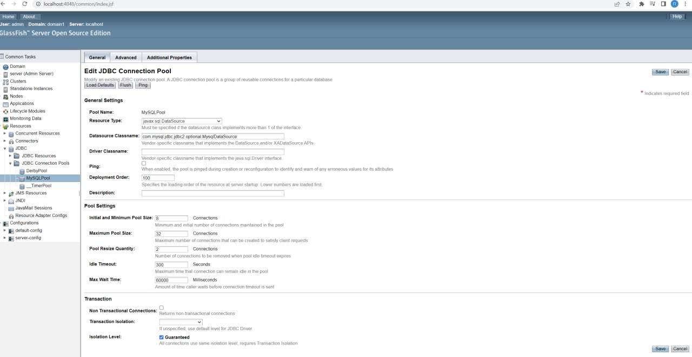
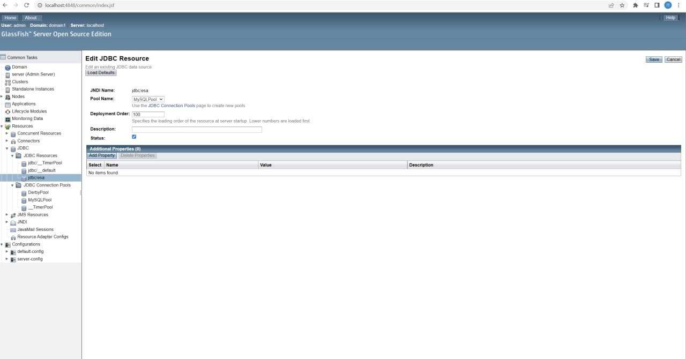
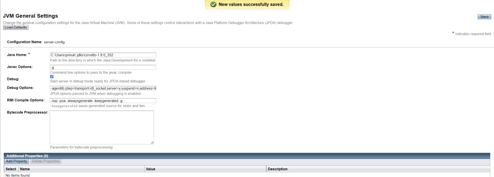
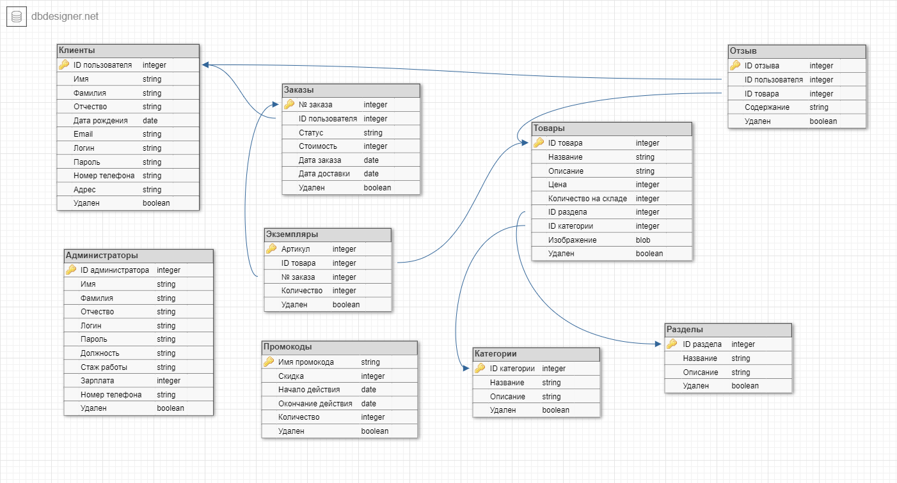
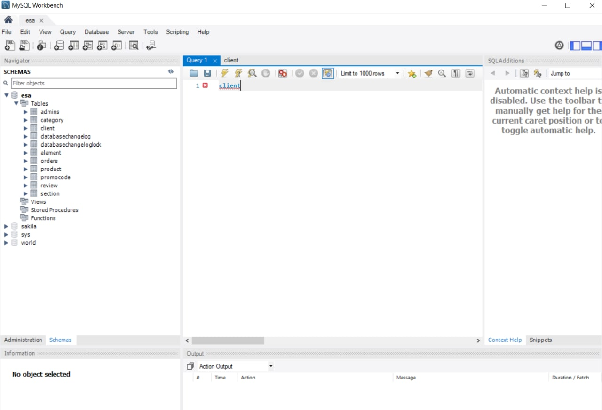
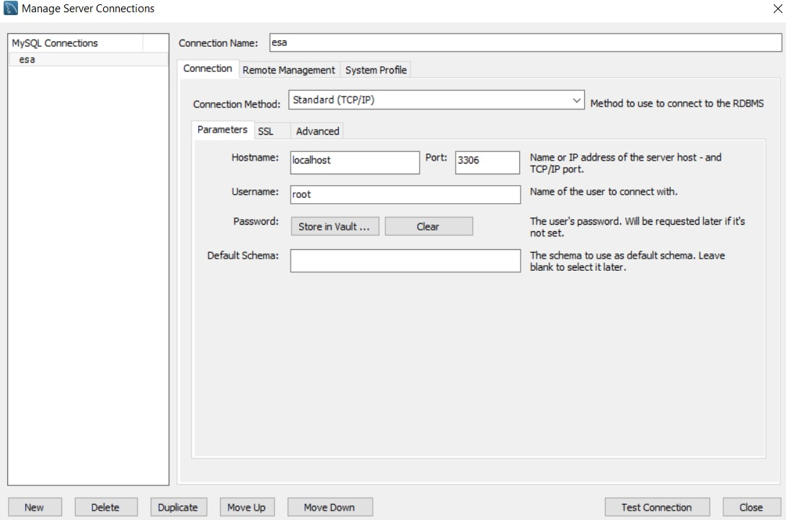
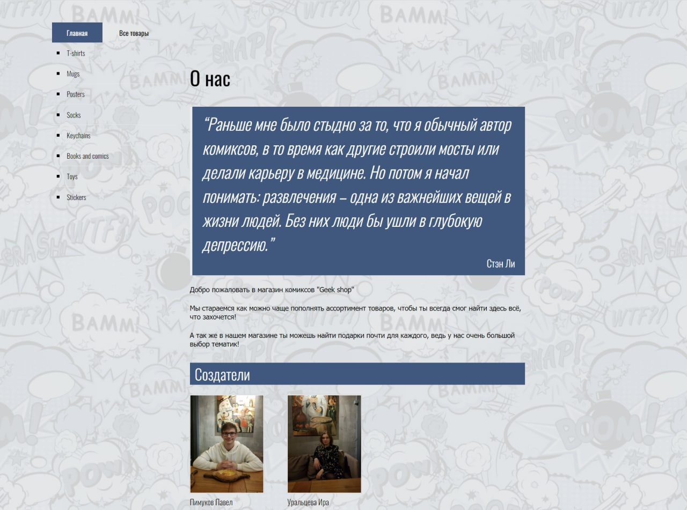
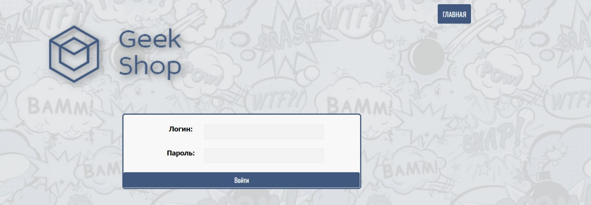
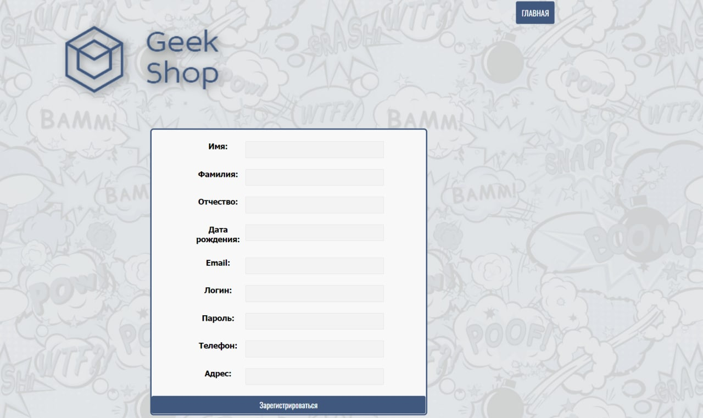
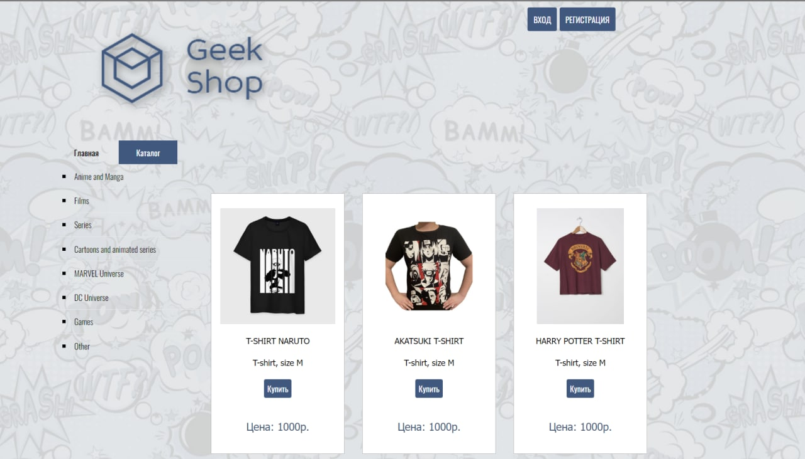

# ESA Lab1
Made by students of 6133-010402D: \
**Pimukov Pavel** and **Irina Uraltseva**

Our project is about web app of online store "Geek shop" \

### Glassfish part
As database we used MySQL    

### DB part
Here is structure of database:

### Web views
Main page:

Login page:

Registration page:

Catalog page:

________

So in this app **you can**:
- Register
- Log in
- View the catalog
- Add items to shopping cart
- Make an order
- View history of orders 
- View order statuses
- Navigate to different filters of items (as "Manga", "Films", "Games" etc.)
